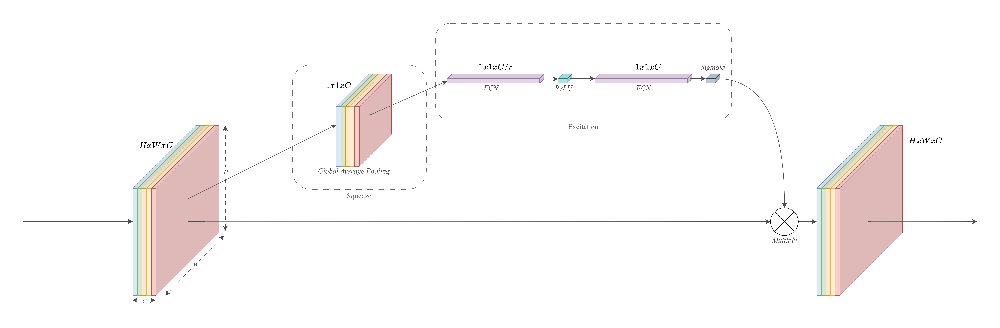
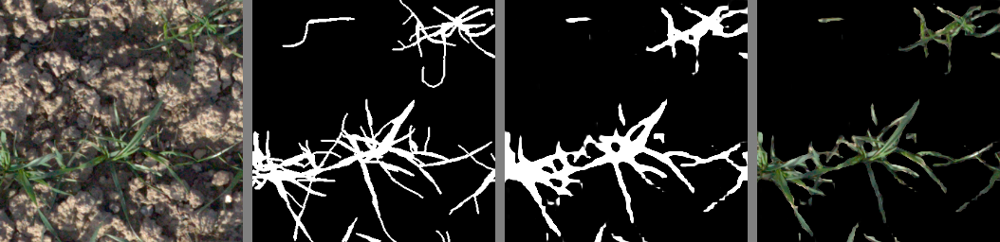
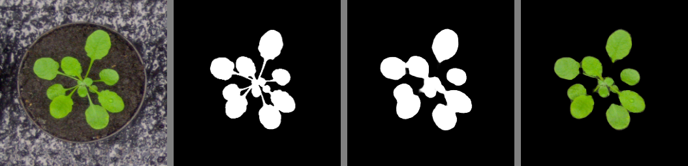
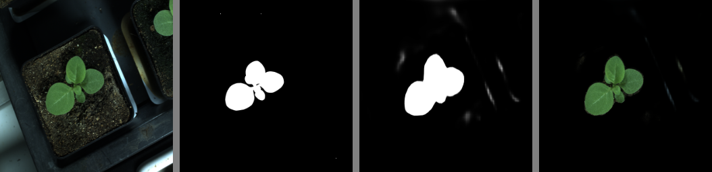
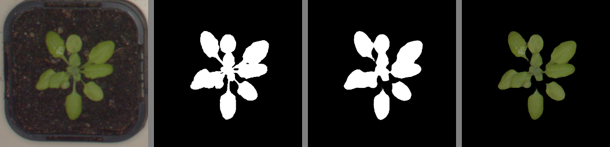
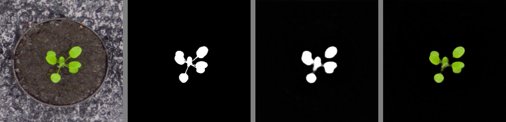
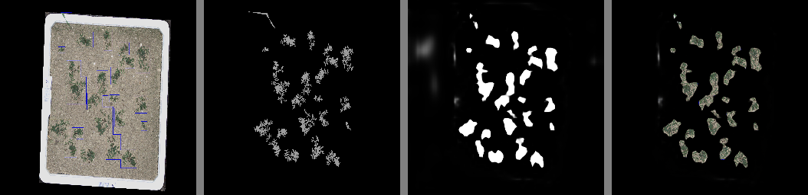

<br/>
<p align="center">
  <h3 align="center">DeepLabV3Plus-PyTorch</h3>

  <p align="center">
    A DeepLab V3+ Model with ResNet 50 Encoder to perform Binary Segmentation Tasks. 
    <br/>
    <br/>
    <a href="https://github.com/mukund-ks/DeepLabV3Plus-PyTorch/issues">Report Bug</a>
    .
    <a href="https://github.com/mukund-ks/DeepLabV3Plus-PyTorch/issues">Request Feature</a>
  </p>
</p>

      

## Table Of Contents

- [Table Of Contents](#table-of-contents)
- [About The Project](#about-the-project)
- [Working](#working)
  - [DeepLabV3+](#deeplabv3)
  - [ResNet Backbone](#resnet-backbone)
  - [Modules used](#modules-used)
- [Results](#results)
  - [EWS](#ews)
  - [CVPPP](#cvppp)
  - [PSS](#pss)
- [Built With](#built-with)
- [Getting Started](#getting-started)
  - [Prerequisites](#prerequisites)
  - [Installation](#installation)
- [Usage](#usage)
- [Folder Structure](#folder-structure)
- [Roadmap](#roadmap)
- [Contributing](#contributing)
  - [Creating A Pull Request](#creating-a-pull-request)
- [License](#license)
- [Authors](#authors)
- [Acknowledgements](#acknowledgements)
- [To Cite this Repository](#to-cite-this-repository)

## About The Project

The goal of this research is to develop a DeepLabV3+ model with a ResNet50 backbone to perform binary segmentation on plant image datasets. Based on the presence or absence of a certain object or characteristic, binary segmentation entails splitting an image into discrete subgroups known as image segments which helps to simplify processing or analysis of the image by reducing the complexity of the image. Labeling pixels is a step in the segmentation process. Each pixel or piece of a picture assigned to the same category has a unique label. 


Plant pictures with ground truth binary mask labels make up the training and validation dataset. The project uses PyTorch, a well-known deep learning library, for model development, training, and evaluation.[^1] During the training process, the model is optimized using strategies like the Dice Loss, Adam optimizer, Reducing LR on Pleateau and Early Stopping. All the while, important metrics like Intersection over Union (IoU), Pixel Accuracy, and Dice Coefficient are kept track of.

[^1]: A Tensorflow implementation can be found [here](https://github.com/mukund-ks/DeepLabV3-Segmentation). 

_Datasets used during development of this project are described below:_
* [EWS Dataset](https://www.research-collection.ethz.ch/handle/20.500.11850/512332)
  
  The Eschikon Wheat Segmentation (EWS) Dataset consists of 190 images that were cropped to 350 by 350 pixel patches and manually labeled as binary masks for soil and plants, respectively. Pixels that the annotator was certain belonged to vegetative active material from a wheat plant should be marked as such. Everything else, including dirt, rocks, and dead plants, is categorized as vegetative inactive material. Following that, the masks were exported as 8-bit, lossless PNG images. 

  Between 2017 and 2020, a Canon 5D Mark II with a 35mm lens and autofocus was used to shoot these pictures. The approximate distance to the ground was 3 m.
  In 2017 and 2018, ISO, aperture, and shutter speed were set using the aperture priority setting; in 2019 and 2020, these settings were set using the shutter speed priority setting. The photographic collection for each year covers the whole growing season, from emergence to harvest. The photos were taken outdoors, in a setting with a wide range of sunlight and soil moisture conditions.


* [Plant Semantic Segmentation Dataset by HIL](https://humansintheloop.org/resources/datasets/plant-segmentation/)
  
  Humans in the Loop (HIL) Plant Semantic Segmentation Dataset was made available as an Open-Access Dataset by The Computer Vision and Biosystems Signal Processing Group at the Department of Electrical and Computer Engineering at Aarhus University.

  144 images of plant seedlings from 3 containers were collected over the course of two months at various intervals and are included in the dataset. Each container holds up to 40 single plants, and to make them easier to see, each plant has been given a bounding box. The photos are 4096 by 3000 pixels in size and manually annotated.

  The annotations are made as such:
  * ‘Background’ class as black.
  * ‘Plant’ class as green.

* [CVPPP Dataset](https://www.plant-phenotyping.org/datasets-home)
  
  The Computer Vision Problems in Plant Phenotyping (CVPPP) Leaf Counting Challenge (LCC) 2017 Dataset provides 27 images of tobacco and 783 Arabidopsis images in separate folders. Using a camera with a single plant in its range of view, tobacco photos were gathered. Images of the Arabidopsis plant were taken with a camera that had a wider field of view and were later cropped.  The photographs were shot over a period of days from mutants or wild types, and they came from two different experimental settings, where the field of vision was different.

  Additionally, certain plants are slightly out of focus than others due to the wider range of view. Though, the backgrounds of most photographs are straightforward and static, occasionally, moss growth or the presence of water in the growing tray complicates the scene.
  For the purpose of obtaining ground truth masks for every leaf/plant in the picture, each image was manually labeled.


The ultimate objective of the project is to develop a strong model that can accurately segment plant-related regions inside photographs, which can have applications in a variety of fields, such as agriculture, botany, and environmental sciences. The included code demonstrates how to prepare the data, create the model's architecture, train it on the dataset, and assess the model's effectiveness using a variety of metrics.

## Working

The objective of binary segmentation, often referred to as semantic binary segmentation, is to categorize each pixel in an image into one of two groups: the foreground (object of interest), or the background. A powerful Encoder-Decoder based architecture for solving binary segmentation challenges, DeepLabV3+ with ResNet50 or ResNet101 as the backbone offers great accuracy and spatial precision.

|  |
| :-------------------------------------------------------------: |
|     *Architecture of this Repository's Model - DeepLabV3+*      |

### DeepLabV3+

Known for its precise pixel-by-pixel image segmentation skills, DeepLabV3+ is a powerful semantic segmentation model. It combines a robust feature extractor, such as ResNet50 or ResNet101, with an effective decoder. This architecture does a great job of capturing both local and global context information, which makes it suitable for tasks where accurate object boundaries and fine details are important. A crucial part is the Atrous Spatial Pyramid Pooling (ASPP) module, which uses several dilated convolutions to collect data on multiple scales. The decoder further improves the output by fusing high-level semantic features with precise spatial data. Highly precise segmentations across a variety of applications are made possible by this fusion of context and location awareness.

### ResNet Backbone

Residual Networks, often known as ResNets, are a class of deep neural network architectures created to address the vanishing gradient problem that can arise in very deep networks. They were first presented in the 2015 publication [*Deep Residual Learning for Image Recognition*](https://ieeexplore.ieee.org/document/7780459) by **Kaiming He et al**. ResNets have been extensively used for a number of tasks, including image classification, object recognition, and segmentation.

The main novelty in ResNets is the introduction of residual blocks, which allow for the training of extremely deep networks by providing shortcut connections (skip connections) that omit one or more layers. Through the use of these connections, gradients can pass directly through the network without disappearing or blowing up, enabling the training of far more complex structures.

ResNets are available in a range of depths, designated as ResNet-XX, where XX is the number of layers. The ResNet-18, ResNet-34, ResNet-50, ResNet-101, and ResNet-152 are popular variations. The performance of the deeper variations is better, but they also use up more processing resources.


### Modules used

* ***Encoder:*** The ResNet backbone's early layers are typically where the encoder is implemented. With growing receptive fields, it has numerous convolutional layers. These layers take the input image and extract low-level and mid-level information. The ASPP module is then given the feature maps the encoder produced.
  
  For pixel-wise predictions, the Encoder is essential in converting raw pixel data into abstract representations. It consists of several layers of convolutional and pooling procedures, arranged into blocks, that gradually increase the number of channels while decreasing the input's spatial dimensions. Because of its hierarchical structure, the model may capture aspects with varied levels of complexity, from simple edges and textures to complicated object semantics.

* ***Atrous Spatial Pyramid Pooling (ASPP):*** The ASPP module executes many convolutions with various dilation rates following the encoder. This records contextual data at various scales. Concatenated and processed outputs from several atrous convolutions are then used to create context-rich features.
  
  By gathering data from diverse scales and viewpoints, the ASPP module improves the network's comprehension of the items in a scene. It is especially useful for overcoming the challenges presented by items with varying sizes and spatial distributions. 

* ***Decoder:*** Through skip connections, the decoder module combines low-level features from the encoder with high-level features from the ASPP module. This method aids in recovering spatial data and producing fine-grained segmentation maps.
  
  This Module enables the network to generate precise and contextually rich segmentation maps by including skip links and mixing data from various scales. This is crucial for tasks like semantic segmentation, where accurate delineation of object boundaries is necessary for producing high-quality results.

* ***Squeeze & Excitation (SE):*** It is a mechanism made to increase the convolutional neural networks' representational strength by explicitly modeling channel-wise interactions. **Jie Hu et al.** first discussed it in their publication [*Squeeze-and-Excitation Networks*](https://ieeexplore.ieee.org/document/8578843) published in 2018. In order to enable the model to focus greater attention on crucial features, the SE Module seeks to selectively emphasize informative channels while suppressing less critical ones within the network. 
  
  By computing the average value of each channel across all spatial dimensions, the global average pooling method is used. The end result is a channel-wise descriptor that accurately reflects the significance of each channel in relation to the overall feature map. 

  The channels are then adaptively recalibrated using the squeezed information. Two fully connected layers are utilized for this. A non-linear activation function, also known as ReLU, is added after the first layer, which minimizes the dimensionality of the squeezed descriptor. A set of channel-wise excitation weights is produced after the second layer returns the dimensionality to the original number of channels. Each channel's weights indicate how much it should be boosted or muted.

  |  |
  | :------------------------------------------------------------------: |
  |                    *Squeeze & Excitation Module*                     |

## Results

Results of the developed Model on EWS, PSS and CVPPP Dataset.

### EWS 

On the basis of IoU, the results of this repository's best performing model are compared to [Zenkl et al. (2022)](https://www.frontiersin.org/articles/10.3389/fpls.2021.774068/full), [Yu et al. (2017)](https://plantmethods.biomedcentral.com/articles/10.1186/s13007-017-0168-4), [Sadeghi-Tehran et al. (2020)](https://spj.science.org/doi/10.34133/2020/3521852) and [Rico-Fernández et al. (2018)](https://www.sciencedirect.com/science/article/abs/pii/S0168169918301911?via%3Dihub).

| Benchmark                        |    IoU    |
| :------------------------------- | :-------: |
| **Repository (Model v1.4)**      | **0.744** |
| **Zenkl et al. (2022)**          |   0.775   |
| **Yu et al. (2017)**             |   0.666   |
| **Sadeghi-Tehran et al. (2020)** |   0.638   |
| **Rico-Fernández et al. (2018)** |   0.691   |

|                                                                   |
| :------------------------------------------------------------------------------------------------------------: |
| *ResNet50 Model v1.4 Result* <br> *Left to Right: Input Image, Ground Truth, Predicted Mask, Segmented Output* |


### CVPPP

Totaling 810 pictures of Tobacco and Arabidopsis plants, the CVPPP LCC 2017 Dataset is divided into 4 directories, **A1** through **A4**. Arabidopsis plant photos are included in divides **A1**, **A2**, and **A4**, which have 128, 31, and 624 images, respectively. 27 photos of tobacco plants are included in **A3**.

A collection of 63 photos from the divides **A1** through **A4** were assembled to form an evaluation set, representing each split.

Model training was done on **A1**, **A2**, **A3**, and **A4** separately for the outcomes of this repository's model. A separate split of 267 photos, consisting of 46 images from **A1**, 20 images from **A2**, and 201 images from **A4**, was also created and utilized for training.

|         Split         |    IoU    | Dice-Loss |
| :-------------------: | :-------: | :-------: |
|          A1           |   0.371   |   0.498   |
|          A2           |   0.865   |   0.100   |
|          A3           |   0.614   |   0.410   |
|          A4           |   0.907   |   0.069   |
| A1+A2+A4 (Model v1.6) | **0.942** | **0.044** |

|                                                               |
| :-------------------------------------------------------------------------------------------: |
| *A2 Result* <br> *Left to Right: Input Image, Ground Truth, Predicted Mask, Segmented Output* |

|                                                               |
| :-------------------------------------------------------------------------------------------: |
| *A3 Result* <br> *Left to Right: Input Image, Ground Truth, Predicted Mask, Segmented Output* |

|                                                               |
| :-------------------------------------------------------------------------------------------: |
| *A4 Result* <br> *Left to Right: Input Image, Ground Truth, Predicted Mask, Segmented Output* |

|                                                             |
| :-------------------------------------------------------------------------------------------------: |
| *A1+A2+A4 Result* <br> *Left to Right: Input Image, Ground Truth, Predicted Mask, Segmented Output* |


### PSS

There are 144 photos in the Humans in the Loop (HIL) Plant Semantic Segmentation (PSS) Dataset. No additional splits were created because of the smaller size of the dataset. The masks from the dataset, however, were thresholded to only contain black or white color. Black is the background, whereas white is the plant.

Data Augmentations were used during training of the model.

The best model found for this dataset produced the results listed below.

|   Model    |  IoU  | Dice-Loss |
| :--------: | :---: | :-------: |
| Best Model | 0.603 |   0.315   |

|                                                          |
| :---------------------------------------------------------------------------------------------------: |
| *Best Model Result* <br> *Left to Right: Input Image, Ground Truth, Predicted Mask, Segmented Output* |

## Built With


* IDE Used:


* Operating System:


## Getting Started

To get a local copy of this project up and running on your machine, follow these simple steps.

* Clone a copy of this Repository on your machine.
```console
git clone https://github.com/mukund-ks/DeepLabV3Plus-PyTorch.git
```

### Prerequisites

* Python 3.9 or above.

```console
python -V
Python 3.9.13
```

* CUDA 11.2 or above.

```console
nvcc -V
nvcc: NVIDIA (R) Cuda compiler driver
Copyright (c) 2005-2021 NVIDIA Corporation
Built on Sun_Feb_14_22:08:44_Pacific_Standard_Time_2021
Cuda compilation tools, release 11.2, V11.2.152
Build cuda_11.2.r11.2/compiler.29618528_0
```

### Installation

1. Move into the cloned repo.
```console
cd DeepLabV3Plus-PyTorch
```

2. Setup a Virutal Environment

```console
python -m venv env
```

3. Activate the Virutal Environment
```console
env/Scripts/activate
```

4. Install Dependencies

```console
pip install -r requirements.txt
```

> **Note**
> You can deactivate the Virtual Environment by using
> ```env/Scripts/deactivate```
 

## Usage

The Model can be trained on the data aforementioned in the [**About**](#about-the-project) section or on your own data.

* To train the model, use [`train.py`](https://github.com/mukund-ks/DeepLabV3Plus-PyTorch/blob/main/train.py)
```console
python train.py --help
```
```console
Usage: train.py [OPTIONS]

  Training Script for DeepLabV3+ with ResNet50 Encoder for Binary
  Segmentation.

  Please make sure your data is structured according to the folder structure
  specified in the Github Repository.

  See: https://github.com/mukund-ks/DeepLabV3Plus-PyTorch

  Refer to the Options below for usage.

Options:
  -D, --data-dir TEXT        Path for Data Directory  [required]
  -E, --num-epochs INTEGER   Number of epochs to train the model for. Default
                             - 25
  -L, --learning-rate FLOAT  Learning Rate for model. Default - 1e-4
  -B, --batch-size INTEGER   Batch size of data for training. Default - 4
  -P, --pre-split BOOLEAN    Opt-in to split data into Training and Validaton
                             set.  [required]
  -A, --augment BOOLEAN      Opt-in to apply augmentations to training set.
                             Default - True
  -S, --early-stop BOOLEAN   Stop training if val_loss hasn't improved for a
                             certain no. of epochs. Default - True
  --help                     Show this message and exit.
```

* For Evaluation, use [`evaluation.py`](https://github.com/mukund-ks/DeepLabV3Plus-PyTorch/blob/main/evaluation.py)
```console
python evaluation.py --help
```
```console
Usage: evaluation.py [OPTIONS]

  Evaluation Script for DeepLabV3+ with ResNet50 Encoder for Binary
  Segmentation.

  Please make sure your evaluation data is structured according to the folder
  structure specified in the Github Repository.

  See: https://github.com/mukund-ks/DeepLabV3Plus-PyTorch

  Refer to the Option(s) below for usage.

Options:
  -D, --data-dir TEXT  Path for Data Directory  [required]
  --help               Show this message and exit.
```
* An Example
```console
python train.py --data-dir data --num-epochs 80 --pre-split False --early-stop False
```
```console
python evaluation.py --data-dir eval_data
```

## Folder Structure

The folder structure will alter slightly depending on whether or not your training data has already been divided into a training and testing set.

- If the data is not already seperated, it should be in a directory called `data` that is further subdivided into `Image` and `Mask` subdirectories.
  
  - [`train.py`](https://github.com/mukund-ks/DeepLabV3Plus-PyTorch/blob/main/train.py) should be run with `--pre-split` option as `False` in this case.
  
    Example: ```python train.py --data-dir data --pre-split False```

> **Note**
> [`dataset.py`](https://github.com/mukund-ks/DeepLabV3Plus-PyTorch/blob/main/dataset.py) will split the data into training and testing set with a ratio of 0.2

```console
$ tree -L 2
.
├── data
│   ├── Image
│   └── Mask
└── eval_data
    ├── Image
    └── Mask
```

- If the data has already been separated, it should be in a directory called `data` that is further subdivided into the subdirectories `Train` and `Test`, both of which contain the subdirectories `Image` and `Mask`.

  - [`train.py`](https://github.com/mukund-ks/DeepLabV3Plus-PyTorch/blob/main/train.py) should be run with `--pre-split` option as `True` in this case.
  
    Example: ```python train.py --data-dir data --pre-split True```

```console
$ tree -L 3
.
├── data
│   ├── Test
│   │   ├── Image
│   │   └── Mask
│   └── Train
│       ├── Image
│       └── Mask
└── eval_data
    ├── Image
    └── Mask
```
* The structure of `eval_data` remains the same in both cases, holding `Image` and `Mask` sub-directories.

> **Note**
> The directory names are case-sensitive.
## Roadmap

See the [open issues](https://github.com/mukund-ks/DeepLabV3Plus-PyTorch/issues) for a list of proposed features (and known issues).

## Contributing

Contributions are what make the open source community such an amazing place to be learn, inspire, and create. Any contributions you make are **greatly appreciated**.
* If you have suggestions for adding or removing projects, feel free to [open an issue](https://github.com/mukund-ks/DeepLabV3Plus-PyTorch/issues/new) to discuss it, or directly create a pull request after you edit the *README.md* file with necessary changes.
* Please make sure you check your spelling and grammar.
* Create individual PR for each suggestion.
* Please also read through the [Code Of Conduct](https://github.com/mukund-ks/DeepLabV3Plus-PyTorch/blob/main/CODE_OF_CONDUCT.md) before posting your first idea as well.

### Creating A Pull Request

1. Fork the Project
2. Create your Feature Branch (`git checkout -b MyBranch`)
3. Commit your Changes (`git commit -m 'Add some AmazingFeature'`)
4. Push to the Branch (`git push -u origin myBranch`)
5. Open a Pull Request

## License

Distributed under the Apache 2.0 License. See [LICENSE](https://github.com/mukund-ks/DeepLabV3Plus-PyTorch/blob/main/LICENSE) for more information.

## Authors

* [**Mukund Kumar Surehli**](https://github.com/mukund-ks/) - *Comp Sci Student* 
* [**Dr. Naveen Aggarwal**](https://github.com/navagg) - *Comp Sci Professor* - *Project Guide* 
* [**Dr. Garima Joshi**](https://www.linkedin.com/in/garima-joshi-b89277128?originalSubdomain=in) - *Comp Sci Professor* - *Project Guide* 

## Acknowledgements

* M. Minervini, A. Fischbach, H.Scharr, and S.A. Tsaftaris. [_Finely-grained annotated datasets for image-based plant phenotyping._](https://www.sciencedirect.com/science/article/abs/pii/S0167865515003645?via%3Dihub) Pattern Recognition Letters, pages 1-10, 2015, [doi:10.1016/j.patrec.2015.10.013](https://www.sciencedirect.com/science/article/abs/pii/S0167865515003645?via%3Dihub)
* H. Scharr, M. Minervini, A.P. French, C. Klukas, D. Kramer, Xiaoming Liu, I. Luengo, J.-M. Pape, G. Polder, D. Vukadinovic, Xi Yin, and S.A. Tsaftaris. [_Leaf segmentation in plant phenotyping: A collation study._](https://link.springer.com/article/10.1007/s00138-015-0737-3) Machine Vision and Applications, pages 1-18, 2015, [doi:10.1007/s00138-015-0737-3.](https://link.springer.com/article/10.1007/s00138-015-0737-3)
* B. Dellen, H. Scharr, and C. Torras. [_Growth signatures of rosette plants from time-lapse video._](https://ieeexplore.ieee.org/document/7044561) IEEE/ACM Transactions on Computational Biology and Bioinformatics, PP(99):1 - 11, 2015, [doi:10.1109/TCBB.2015.2404810](https://ieeexplore.ieee.org/document/7044561)
* E.E. Aksoy, A. Abramov, F. Wörgötter, H. Scharr, A. Fischbach, and B. Dellen. [_Modeling leaf growth of rosette plants using infrared stereo image sequences._](https://www.sciencedirect.com/science/article/abs/pii/S0168169914002816?via%3Dihub) Computers and Electronics in Agriculture, 110:78 - 90, 2015, [doi:10.1016/j.compag.2014.10.020](https://www.sciencedirect.com/science/article/abs/pii/S0168169914002816?via%3Dihub)
* M. Minervini , M.M. Abdelsamea, S.A. Tsaftaris. [_Image-based plant phenotyping with incremental learning and active contours._](https://www.sciencedirect.com/science/article/abs/pii/S1574954113000691?via%3Dihub) Ecological Informatics 23, 35–48, 2014, [doi:10.1016/j.ecoinf.2013.07.004](https://www.sciencedirect.com/science/article/abs/pii/S1574954113000691?via%3Dihub)
* Polat H. [_A modified DeepLabV3+ based semantic segmentation of chest computed tomography images for COVID-19 lung infections._](https://www.ncbi.nlm.nih.gov/pmc/articles/PMC9349869/) Int J Imaging Syst Technol. 2022;32(5):1481-1495. [doi:10.1002/ima.22772](https://www.ncbi.nlm.nih.gov/pmc/articles/PMC9349869/)
* Li, K. (2022). [_Study on the segmentation method of the improved deeplabv3+ algorithm in the basketball scene._](https://www.hindawi.com/journals/sp/2022/3311931/) Scientific Programming, 2022, 1–7. https://doi.org/10.1155/2022/3311931
* Wang Y, Wang C, Wu H, Chen P (2022) [_An improved Deeplabv3+ semantic segmentation algorithm with multiple loss constraints._](https://journals.plos.org/plosone/article?id=10.1371/journal.pone.0261582) PLOS ONE 17(1): e0261582. https://doi.org/10.1371/journal.pone.0261582
* Zenkl, R., Timofte, R., Kirchgessner, N., Roth, L., Hund, A., Van Gool, L., Walter, A., &amp; Aasen, H. (2022). [_Outdoor plant segmentation with deep learning for high-throughput field phenotyping on a diverse wheat dataset._](https://www.frontiersin.org/articles/10.3389/fpls.2021.774068/full) Frontiers in Plant Science, 12. https://doi.org/10.3389/fpls.2021.774068 
* Hsu C-Y, Hu R, Xiang Y, Long X, Li Z. [_Improving the Deeplabv3+ Model with Attention Mechanisms Applied to Eye Detection and Segmentation._](https://www.mdpi.com/2227-7390/10/15/2597) Mathematics. 2022; 10(15):2597. https://doi.org/10.3390/math10152597
* Singh, V. (2023, January 17). _The Ultimate Guide to deeplabv3 - with Pytorch Inference._ LearnOpenCV. https://learnopencv.com/deeplabv3-ultimate-guide/ 
* Zualkernan, I., Abuhani, D. A., Hussain, M. H., Khan, J., & ElMohandes, M. (2023). [_Machine Learning for Precision Agriculture Using Imagery from Unmanned Aerial Vehicles (UAVs): A Survey._](https://www.mdpi.com/2504-446X/7/6/382) Drones, 7(6), 382. https://doi.org/10.3390/drones7060382
* S. Minaee, Y. Boykov, F. Porikli, A. Plaza, N. Kehtarnavaz and D. Terzopoulos, [_Image Segmentation Using Deep Learning: A Survey_](https://ieeexplore.ieee.org/document/9356353), in IEEE Transactions on Pattern Analysis and Machine Intelligence, vol. 44, no. 7, pp. 3523-3542, 1 July 2022, [doi: 10.1109/TPAMI.2021.3059968](https://ieeexplore.ieee.org/document/9356353).
* Pröve, P. L. (2017, October 18). _Squeeze-and-Excitation Networks_. Retrieved from https://towardsdatascience.com/squeeze-and-excitation-networks-9ef5e71eacd7
* Chen, LC., Zhu, Y., Papandreou, G., Schroff, F., Adam, H. (2018). [_Encoder-Decoder with Atrous Separable Convolution for Semantic Image Segmentation_](https://link.springer.com/chapter/10.1007/978-3-030-01234-2_49). In: Ferrari, V., Hebert, M., Sminchisescu, C., Weiss, Y. (eds) Computer Vision – ECCV 2018. ECCV 2018. Lecture Notes in Computer Science(), vol 11211. Springer, Cham. https://doi.org/10.1007/978-3-030-01234-2_49
* Zhou, E., Xu, X., Xu, B. et al. [_An enhancement model based on dense atrous and inception convolution for image semantic segmentation_](https://link.springer.com/article/10.1007/s10489-022-03448-w). Appl Intell 53, 5519–5531 (2023). https://doi.org/10.1007/s10489-022-03448-w
* M. S. Minhas, _Transfer Learning for Semantic Segmentation using PyTorch DeepLab v3_, GitHub.com/msminhas93, 12-Sep-2019. Available: https://github.com/msminhas93/DeepLabv3FineTuning.
* Kou, L., Sysyn, M., Fischer, S., Liu, J., & Nabochenko, O. (2022). [_Optical Rail Surface Crack Detection Method Based on Semantic Segmentation Replacement for Magnetic Particle Inspection_](https://www.mdpi.com/1424-8220/22/21/8214). Sensors, 22(21), 8214. https://doi.org/10.3390/s22218214
* Zhang C, Gao S, Yang X, Li F, Yue M, Han Y, Zhao H, Zhang Y, Fan K. [_Convolutional Neural Network-Based Remote Sensing Images Segmentation Method for Extracting Winter Wheat Spatial Distribution_](https://www.mdpi.com/2076-3417/8/10/1981). Applied Sciences. 2018; 8(10):1981. https://doi.org/10.3390/app8101981
* Zhang, D., Zhang, L. & Tang, J. [_Augmented FCN: rethinking context modeling for semantic segmentation_](https://link.springer.com/article/10.1007/s11432-021-3590-1). Sci. China Inf. Sci. 66, 142105 (2023). https://doi.org/10.1007/s11432-021-3590-1
* Zeiler, M. D., & Fergus, R. (2013, November 12). _Visualizing and Understanding Convolutional Networks_. Retrieved from https://arxiv.org/abs/1311.2901v3
* Chen, L., Papandreou, G., Schroff, F., & Adam, H. (2017). [_Rethinking Atrous Convolution for Semantic Image Segmentation_](https://www.semanticscholar.org/paper/Rethinking-Atrous-Convolution-for-Semantic-Image-Chen-Papandreou/ee4a012a4b12d11d7ab8c0e79c61e807927a163c). ArXiv, abs/1706.05587.
* Z. Zhang, X. Wang and C. Jung, [_DCSR: Dilated Convolutions for Single Image Super-Resolution_](https://ieeexplore.ieee.org/document/8502129), in IEEE Transactions on Image Processing, vol. 28, no. 4, pp. 1625-1635, April 2019, [doi: 10.1109/TIP.2018.2877483](https://ieeexplore.ieee.org/document/8502129).
* K. He, X. Zhang, S. Ren and J. Sun, [*Deep Residual Learning for Image Recognition*](https://ieeexplore.ieee.org/document/7780459), 2016 IEEE Conference on Computer Vision and Pattern Recognition (CVPR), Las Vegas, NV, USA, 2016, pp. 770-778, [doi: 10.1109/CVPR.2016.90](https://ieeexplore.ieee.org/document/7780459).
* [EWS Dataset](https://doi.org/10.3389/fpls.2021.774068)
* [Plant Phenotyping Dataset](https://www.plant-phenotyping.org/datasets)
* [Plant Semantic Segmentation Dataset by HIL](https://humansintheloop.org/resources/datasets/plant-segmentation/)


## To Cite this Repository


Surehli, M. K., Aggarwal, N., & Joshi, G. (2023, August 6). GitHub - mukund-ks/DeepLabV3Plus-PyTorch: _A DeepLab V3+ Model with ResNet 50 Encoder to perform Binary Segmentation Tasks. Implemented with PyTorch._ Retrieved from https://github.com/mukund-ks/DeepLabV3Plus-PyTorch
